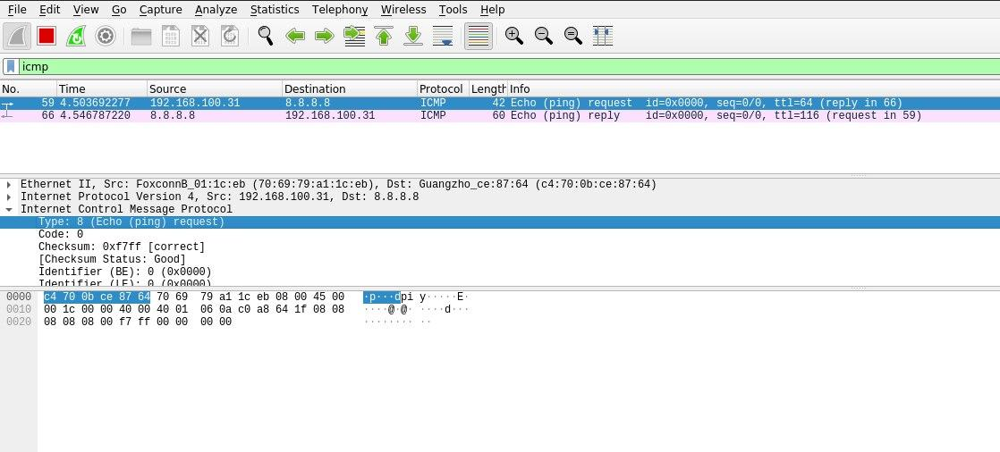

# LDS-Labs

[](https://lds.inf.br/)

C++11 ping ICMP client implementation.

## How to compile this project

Do a make.

```sh
make
```

## How to use this project

Just run the binary with sudo (because its needs kernel authorization) and pass as a parameters the source IP and destination IP.

```sh
sudo ./build/icmp-client 192.168.100.31 8.8.8.8
```

Then, you can see the magic with wireshark software

[]()
